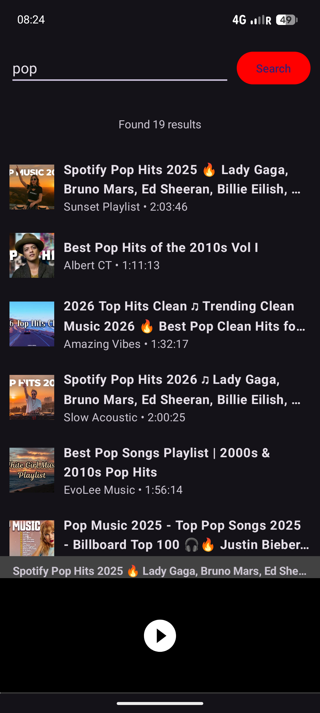

# YT Music Search

Search and stream songs from YouTube on your Android phone. Everything runs on-device — no server, no account.

## Features

- Search YouTube and play any song
- Background playback with a media notification
- Simple, no-login

## Download

Get the latest APK from the **[Releases](https://github.com/adegard/ytmusic-apk/releases)** page.

## Install

1. Download the APK from Releases.
2. Allow "install from unknown sources" when asked.
3. Search and play.



## Build

```bash
./gradlew assembleDebug
# output: app/build/outputs/apk/debug/app-debug.apk
```

## iOS

An iOS companion app (same on-device, no-login approach) lives in the [`ios/`](ios/README.md) folder.

## Web app (PWA)

No install needed: a browser app that runs on iPhone and Android lives in [`web/`](web/README.md) — installable to the home screen, background audio included. It needs a free Cloudflare Worker proxy (see its README).

## License

MIT
